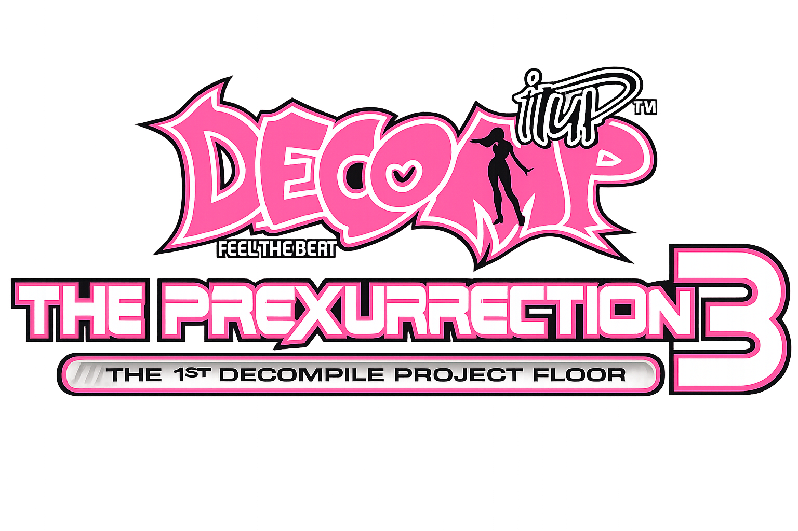

# PumpyReconstructed

A faithful C reconstruction of **PUMPY.EXE**, the arcade executable for **Pump It Up: Premiere 3** (1999).

This project reverse-engineers the original x86 binary and reproduces its gameplay, rendering, audio, and state machine as closely as possible — no emulation, no wrappers. Native Windows executable built with OpenGL and DirectSound.

## Status — v0.6

| Feature | Status |
|---|---|
| Song select + difficulty | ✅ |
| Gameplay (5-panel, scrolling, holds) | ✅ |
| Timing windows (Perfect/Great/Good/Bad/Miss) | ✅ |
| Combo system + scoring | ✅ |
| Grade calculation + stage flow | ✅ |
| Judge animation (pop-in + squeeze) | ✅ |
| Arrow animation (n1→n6 cycling) | ✅ |
| Hit flash (p1 border on input) | ✅ |
| Explosion effect (ARROWF.SPR) | ✅ |
| Hold bodies / tails auto-capture | ✅ |
| Life bar (03/04/05.SPR) | ✅ |
| BGA playback (BGA/BGA2/VSL) | ✅ |
| BGM audio (DirectSound + MCI) | ✅ |
| Menu + staff screen | ✅ |
| Stage transition flow | ✅ |
| P2 input handling | 🚧 Disabled |
| Modifiers (random/mirror/vanish) | ❌ |
| Fade in/out transitions | ✅ |
| FreeStyle/Nightmare | ❌ |
| HalfDouble | ❌ |
| Division | ❌ |

## Project Structure

```
PumpyReconstructed/
├── src/           # C source files
│   ├── main.c     # Entry point, state machine, game loop
│   ├── gameplay.c # Core input, judgment, hold, and rendering
│   ├── result.c   # Grade calculation and result screen
│   ├── menu.c     # Menu state handling
│   ├── song_select.c
│   ├── loading.c
│   ├── staff.c    # Credits screen
│   ├── resource.c # SPR/SP2/BGA/DAT resource loading
│   ├── font.c     # Font rendering (GDI bitmaps + DEC00)
│   ├── texture.c  # OpenGL texture management
│   ├── util.c     # Sprite rendering helpers
│   ├── bga.c      # BGA/BGA2 playback
│   ├── vsl.c      # 3D VSL mesh rendering
│   ├── audio.c    # DirectSound BGM
│   ├── render.c   # OpenGL projection setup
│   ├── window.c   # Win32 window creation
│   ├── input.c    # Keyboard input mapping
│   └── ...
├── include/       # C headers
│   ├── pumpy.h    # Main game state struct
│   ├── step.h     # Step data format
│   └── ...
└── CMakeLists.txt # Build configuration
```

## Building

Requirements:
- Windows (the original targets Win95, but builds on 10/11)
- Visual Studio 2022 (or compatible MSVC)
- CMake 3.10+

```bash
mkdir build && cd build
cmake ..
cmake --build . --config Release
```

Place the resulting `.exe` in the game's root directory alongside `AUDIO/`, `BGA/`, and `BGA_extracted/` folders from the original game. Assets are **not** included — you must provide your own copy of PUMP IT UP Prex 3 data files.

## Technical Notes

### Coordinate System
- OpenGL projection: **Y-UP** (0 at bottom, 480 at top)
- External API: **Y-DOWN** (0 at top, 480 at bottom)
- `Texture_DrawUV` converts Y-DOWN to Y-UP internally

### SPR vs SP2
- **`.sp2`**: u2/v2 are **offsets** (width/height) from u1/v1. Negative = flip. Use `SPR_LoadSP2()`.
- **`.spr`**: u2/v2 are **absolute** pixel coordinates (left/top → right/bottom). Use `SPR_LoadSPR()`.

### Judge Animation (FUN_0040dd70)

The judge display has three phases matching the original:

1. **Pop-in** (timer 24→11): Uniform scale from 1.43× down to 0.99× (ease-out)
2. **Stable** (timer 10→9): Scale fixed at 1.0×
3. **Squeeze** (timer 8→0): X-axis only scale shrinks (1.52→1.35) with alpha fade, additive blend

Perfect/Great get a longer animation (40 frames vs 25 for others). An implicit 0.8× scale is applied to the judge sprite itself.

### Hold System

Hold notes (heads, bodies, tails) use a per-panel auto-capture system:
- `g_holdRows[p][panel]` tracks active hold row
- Auto-capture scans from `g_nextNoteRow` for HH/HB/HT when button is held and timing window is valid
- Hold bodies use `g_fontArrowETC` with per-panel tile offsets
- Per-panel clearing avoids `memset` collisions with taps on hold rows

### Scoring

- Every note gives 1000 base + 1000 bonus if `combo > 3`
- Grade formula: `(perfect×10 + great×7 + good×5 + bad×2) / (total×10)`
- Thresholds: S≥0.95, A≥0.85, B≥0.75, C≥0.60, D≥0.40, F<0.40

## License

This project is for educational and research purposes only. It is not affiliated with or endorsed by Andamiro Co., Ltd. All original game assets remain the property of their respective owners.
