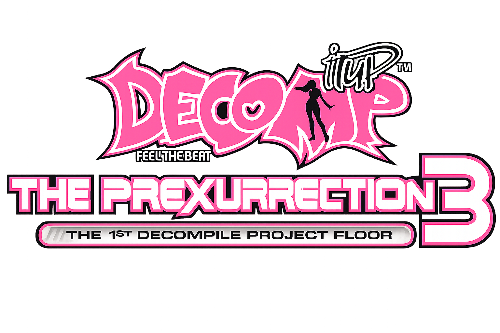

# PumpyReconstructed

A faithful C reconstruction of **PUMPY.EXE**, the arcade executable for **Pump It Up: PREX 3** (1999).

This project reverse-engineers the original x86 binary and reproduces its gameplay, rendering, audio, and state machine as closely as possible — no emulation, no wrappers. Native executable for Windows and Linux, built with SDL2 + OpenGL.

## Status — v0.9.5

| Feature                                      | Status                  |
| -------------------------------------------- | ----------------------- |
| Song select + difficulty                     | ✅                       |
| Gameplay (5-panel, scrolling, holds)         | ✅                       |
| Timing windows (Perfect/Great/Good/Bad/Miss) | ✅                       |
| Combo system + scoring                       | ✅                       |
| Grade calculation + stage flow               | ✅                       |
| Judge animation (pop-in + squeeze)           | ✅                       |
| Arrow animation (n1→n6 cycling)              | ✅                       |
| Hit flash (p1 border on input)               | ✅                       |
| Explosion effect (ARROWF.SPR)                | ✅                       |
| Hold bodies / tails auto-capture             | ✅                       |
| Life bar (03/04/05.SPR)                      | ✅                       |
| BGA playback (BGA/BGA2/VSL)                  | ✅                       |
| BGM/SFX audio (SDL2)                         | ✅                       |
| Menu + staff screen                          | ✅                       |
| Stage transition flow                        | ✅                       |
| P2 input handling                            | ✅                       |
| Modifiers (random/mirror/vanish)             | 🚧 Implemented           |
| Fade in/out transitions                      | ✅                       |
| FreeStyle/Nightmare                          | ✅                       |
| HalfDouble                                   | ✅                       |
| Division                                     | ⏳ Planned for post-v1.0 |

## Project Structure

```
PumpyReconstructed/
├── src/           # C source files
│   ├── main.c     # Entry point, state machine, game loop
│   ├── gameplay.c # Core input, judgment, hold, and rendering
│   ├── result.c   # Grade calculation and result screen
│   ├── menu.c     # Menu state handling
│   ├── song_select.c
│   ├── loading.c
│   ├── staff.c    # Credits screen
│   ├── eeprom.c   # Service menu / credits / settings persistence (pumpprex3.ini)
│   ├── resource.c # SPR/SP2/BGA/DAT resource loading
│   ├── font.c     # Font rendering (font8x8 bitmaps, GDI-free)
│   ├── texture.c  # OpenGL texture management
│   ├── util.c     # Sprite rendering helpers
│   ├── bga.c      # BGA/BGA2 playback
│   ├── vsl.c      # 3D VSL mesh rendering
│   ├── audio.c    # SDL2 BGM/SFX
│   ├── render.c   # OpenGL projection setup
│   ├── window.c   # SDL2 window creation
│   ├── input.c    # Keyboard input mapping (pad keys via piukey.cfg, original format)
│   ├── platform_posix.c # Win32 helper shims (timeGetTime, etc.) for non-Windows builds
│   └── ...
├── include/       # C headers
│   ├── pumpy.h    # Main game state struct
│   ├── step.h     # Step data format
│   ├── platform_linux.h # Win32 type/macro shims used when not building for Windows
│   └── ...
├── tools/         # Standalone helpers (not part of the game binary)
│   ├── extract_wave.py  # Pulls the 35 embedded SFX out of an unpacked PUMPY.EXE
│   ├── res_extract.c    # Lists/extracts entries from the BGA/*.DAT resource containers
│   └── analysis/        # Scripts used to diff the port against the original disassembly
├── docs/
│   └── PARIDADE.md # Instruction-by-instruction parity notes vs. the original binary
└── CMakeLists.txt # Build configuration
```

## Building (Windows and Linux)

The same source builds on both: window, input and audio use **SDL2**, rendering is
**OpenGL 1.1 + GLU** (immediate mode, so it also works with Windows' stock `opengl32`).

**Linux**

```bash
sudo apt install cmake build-essential libsdl2-dev libgl-dev libglu1-mesa-dev zlib1g-dev
cmake -S . -B build -DCMAKE_BUILD_TYPE=Release
cmake --build build --parallel
```

Without the `-dev` packages CMake falls back to the vendored headers in
`third_party/linux` and links the runtime `.so` files directly (needs SDL2, GL, GLU
and zlib *runtime* libraries).

**Windows** (Visual Studio 2019+ or MinGW-w64, with [vcpkg](https://vcpkg.io))

```powershell
vcpkg install sdl2:x64-windows zlib:x64-windows
cmake -S . -B build -A x64 -DCMAKE_TOOLCHAIN_FILE=<vcpkg>/scripts/buildsystems/vcpkg.cmake
cmake --build build --config Release
```

`SDL2.dll` is copied next to `Pumpy.exe` after the build. The `.github/workflows/build.yml`
CI builds both targets on every push; that is the reference for the Windows build.

To have the binary copied into your game folder after each build, pass
`-DPUMPY_GAME_DIR="/path/to/Pump It Up"`.

Place the resulting `.exe` in the game's root directory alongside the `AUDIO/` and `BGA/` folders from the original game. The sound effects live inside the original `PUMPY.EXE`; extract them to `WAVE/` with
`tools/extract_wave.py` (see the script header; the shipped exe is UPX-packed, unpack a copy first).
Assets are **not** included — you must provide your own copy of PUMP IT UP Prex 3 data files.

## Reverse-Engineering Tools

- `tools/res_extract.c` — lists/extracts entries from the BGA `.DAT` resource containers (same XOR-keyed directory format as `RES_Open`/`RES_Read` in `src/resource.c`), without needing OpenGL. Build with `cc -O2 -o res_extract tools/res_extract.c`.
- `tools/extract_wave.py` — pulls the 35 embedded sound effects out of an unpacked `PUMPY.EXE`.
- `tools/analysis/` — Python scripts (disassembly diffing, cross-references, string/keymap search) used to compare the port against the original x86 binary. See `tools/analysis/LEIAME.md`.
- `docs/PARIDADE.md` — running, instruction-by-instruction parity log between the original `PUMPY.EXE` and this port (keys, gameplay formulas, EEPROM layout, build differences, and known limitations of the analysis).

## Technical Notes

### Coordinate System

- OpenGL projection: **Y-UP** (0 at bottom, 480 at top)
- External API: **Y-DOWN** (0 at top, 480 at bottom)
- `Texture_DrawUV` converts Y-DOWN to Y-UP internally

### SPR vs SP2

- **`.sp2`**: u2/v2 are **offsets** (width/height) from u1/v1. Negative = flip. Use `SPR_LoadSP2()`.
- **`.spr`**: u2/v2 are **absolute** pixel coordinates (left/top → right/bottom). Use `SPR_LoadSPR()`.

### Judge Animation (FUN_0040dd70)

The judge display has three phases matching the original:

1. **Pop-in** (timer 24→11): Uniform scale from 1.43× down to 0.99× (ease-out)
2. **Stable** (timer 10→9): Scale fixed at 1.0×
3. **Squeeze** (timer 8→0): X-axis only scale shrinks (1.52→1.35) with alpha fade, additive blend

Perfect/Great get a longer animation (40 frames vs 25 for others). An implicit 0.8× scale is applied to the judge sprite itself.

### Hold System

Hold notes (heads, bodies, tails) use a per-panel auto-capture system:

- `g_holdRows[p][panel]` tracks active hold row
- Auto-capture scans from `g_nextNoteRow` for HH/HB/HT when button is held and timing window is valid
- Hold bodies use `g_fontArrowETC` with per-panel tile offsets
- Per-panel clearing avoids `memset` collisions with taps on hold rows

### Scoring

- Every note gives 1000 base + 1000 bonus if `combo > 3`
- Grade formula: `(perfect×10 + great×7 + good×5 + bad×2) / (total×10)`
- Thresholds: S≥0.95, A≥0.85, B≥0.75, C≥0.60, D≥0.40, F<0.40

## License

This project is for educational and research purposes only. It is not affiliated with or endorsed by Andamiro Co., Ltd. All original game assets remain the property of their respective owners.
